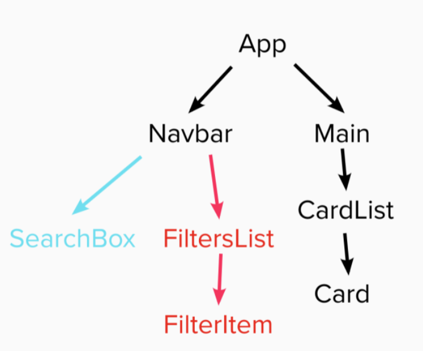
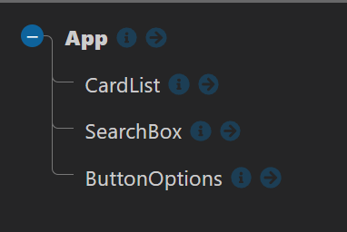

# Feedback

Hey Charlie here, feel free to message me on Slack if you want any clarification on the points below. I will give you both positive and constructive feedback on your project.

---

## Requirements

- Should be built in React - DONE
- Use the Punk API (after using the data file first)
  - DATA FILE - DONE
  - API - DONE
- Test where possible (RTL) - NOT DONE
  - Was covered late on the course so try and some tests when you have time.
- Repository on GitHub - DONE

### Start

> "All the wireframe content in black is the first part of the challenge - that is, the sidenav, the main section containing the beers and beer cards for each piece of data. The component tree is below to help you get started."

Below I have the component tree from the brief and your component tree.





You are missing the `<Navbar/>` , `<FilterList/>`, `<Main/>` and `<Card/>` components.

The reason why we have them in the brief is to force you to think in terms of components we also want to make you pass data with props.

It is important to think about how you break a project into small reusable components, this is how you build large applications. When you have components you need to know how you can get props through multiple components. From the top to the bottom.

At the moment you are only ever passing props one level

e.g from the `<App/>` to `<CardList/>`

If you had the missing components you would of had to pass props through multiple components.

e.g. from `<App/>` to `<Main/>` to `<CardList/>` to `<Card/>`

It may seem like overkill and might be for an application this size but it is something you need to be confident with.

When you have some time create the components above, it will be good practice creating components and also getting props to the components that need them.

### Extension 1

> Once you've got the design and layout sorted to render the elements, it's time to add some search functionality. Make it so you can search the beers by their name, and the page content should update as you type each letter in the box.

The aim of this extension is to get you using functions as props. You have done it, `handleInput()` in your app is being passed to your `<SearchBox/>` component. That component is using the function to capture the user input and you are storing it in the App state.

You have hooked it up to send a request to the API when this changes. The API handles the search filtering. This is great, good going!

As mentioned above it would have been good to see the `handleInput()` function being passed through multiple components.

I think you can refactor your calls to the API to filter with the search term, you are repeating yourself.

It is good to get functionality first once you have it working you can always refactor.

At the moment you have multiple get functions which are pretty similar. They send a request to and API and set it to state, you have two `useEffects` controlling when either is ran. The only thing that is different is the query parameter.

```jsx
// App.jsx

const getBeers = async beerName => {
  let url = "https://api.punkapi.com/v2/beers";
  // MOVE THE CHECK INSIDE THE FUNCTION
  if (beerName !== "") url += `?beer_name=${beerName}`;
  // ^^ ADD THE QUERY PARAM IF YOU HAVE A SEARCH TERM

  const response = await fetch(url);
  const data = await response.json();

  setBeers(data);
};
// ONE USE EFFECT NOW
useEffect(() => {
  getBeers(searchTerm);
}, [searchTerm]);
```

You can have one function to get the beers and one useEffect calling it.

### Extension 2

> Finally attempt to make it so you can filter the content on three conditions:
>
> - High Alcohol (ABV value greater than 6%)
> - Classic Range (Was first brewed before 2010)
> - High Acidity (pH lower than 4)

You haven't been able to get this to work and I can see multiple attempts to try and implement it which is good to see you try. It would have been good to catch up before the hand in as you almost have it.

I am going to show you small steps you can take to get one of the filters working using the code that you have. You are very close.

```jsx
// ButtonOptions.jsx
const ButtonOptions = ({ onClick, selected }) => {
  const buttonNames = ["High ABV (> 6.0%)", "Classic Range", "Acidic (PH < 4)"];

  const buttonsJSX = buttonNames.map((buttonName, index) => {
    // IF YOU ARE USING BUTTONS YOU WILL NEED TO KNOW WHICH ONE HAS BEEN SELECTED.
    // BELOW USES A TURNERY TO SEE IT HAS BEEN SELECTED
    // YOU WILL NEED TO ADD A filter-options-buttons--active CLASS TO YOUR SCSS
    const buttonStyles = selected.includes(buttonName)
      ? "filter-options-buttons filter-options-buttons--active"
      : "filter-options-buttons";
    // YOU ARE USING VALUE, YOU WANT TO USE AN ID
    // - YOU DO NOT STORE VALUES ON BUTTONS
    return (
      <button onClick={onClick} className={buttonStyles} key={"filter-options" + buttonName + index} id={buttonName}>
        {buttonName}
      </button>
    );
  });

  return <div>{buttonsJSX}</div>;
};
```

The `<ButtonOptions/>` component maps over the buttonNames creating the buttons each button uses an ID so you can find out which one has been clicked in the app.

```jsx
// App.jsx
// AS YOU ARE STORING THE VALUE TO FILTER AS A STRING I WILL DO THE SAME
// I HAVE JUST RENAMED IT FROM selectedBeers
const [filterBy, setFilterBy] = useState("");

const handleClick = event => {
  // event.target.id -> THE ID WE GIVE TO THE BUTTONS IN <ButtonOptions/>
  // IF THE STATE HAS THE ID THAT MEANS WE WANT TO REMOVE IT
  // - SOMEONE IS UN CLICKING IT
  if (filterBy.includes(event.target.id)) {
    setFilterBy(filterBy.replace(event.target.id, ""));
  } else {
    // WE WILL ADD IT TO THE CURRENT STATE
    // THE STATE WILL A STRING WITH THE ID'S WE WANT TO FILTER BY
    setFilterBy(filterBy + event.target.id);
  }
};
```

The last piece is the API call and you were very close. The code below builds on simplifying your API as mentioned previously.

The way that query params work is that you have a parameter an then assign it to a value.

So with this example `?beer_name=buzz`

- The parameter is `beer_name`
- The value is equal to `=buzz`

So instead of just `abv_gt` you need to give it a value `abv_gt=6`.

```jsx
// App.jsx
// THIS WILL NOW TAKE THE FILTER BY STATE STRING
const getBeers = async (beerName, filters) => {
  let url = "https://api.punkapi.com/v2/beers";
  if (beerName !== "") url += `?beer_name=${beerName}`;
  // IT CAN USE IT TO SEE IF IT HAS AN ID
  // IF IT DOES IT WILL ADD THE CORRECT QUERY PARAM TO THE URL
  if (filters.includes("High ABV (> 6.0%)")) {
    // CHECK IF WE NEED TO USE & OR ?
    // & IS WHEN YOU HAVE MULTIPLE PARAMS -> SEARCH AND ABV
    // ? IS WHEN YOU HAVE ONE -> ABV
    url += beerName ? "&abv_gt=6" : "?abv_gt=6";
  }

  const response = await fetch(url);
  const data = await response.json();

  setBeers(data);
};
// IN THE USE EFFECT WE GIVE IT THE FILTER BY STATE IT NOW NEEDS
useEffect(() => {
  getBeers(searchTerm, filterBy);
}, [searchTerm, filterBy]);
```

This is just to do the ABV filter. You should be able to follow similar logic for the classic filter. You will need to look at the query param for that filter.

With the ph you will not be able to use a query param to filter it, how else can you filter in javascript?

### Extension 3

> Style the website however you see fit! Go wild!

You have some basic styles that work for the 25 beers the api gives you back.

I can see that you have prioritized the functionality which makes sense, when you have time come back and style it :).

---

## The App

### Positive

- It displays the content on desktop and matches the wire frame basic layout.
- I like the pink you are using.
- You have most of the functionality that was requested.
- Parts are dynamic and are responding to the user interacting with the search box.

### Constructive

Needs to be more responsive for smaller devices

At some point you must have accidentally deleted your `.gitignore` file. This meant that you had the `node_modules` on github. You never want git to be watching this folder. This is bad idea as this is a big folder that can be autogenerated from the package.json. I had to delete the folder in order to get you project onto my computer. I have created a basic `.gitignore` file in the repo to ignore the `node_modules` folder you will need to pull these changes onto your computer.

Let me know if you need a hand as you never want git to watch `node_modules` as they are quite big. This is why you have the `.gitignore` file, read the article below.

[gitignore]("https://www.freecodecamp.org/news/gitignore-what-is-it-and-how-to-add-to-repo")

It must have taken ages to preform a push, if it is still taking a long time we may need to remove git and add it again. Let me know if you want a hand with this.

---

## The Code

### Positive

- You have multiple functions being passed across your application to the components that need them.

- You are utilizing the power of query params to apply the search filter!

- I feel confident with your understanding of props, useState, useEffect and funcs as props.

- Awesome good going! I can't wait to see what you build next.

### Constructive

- You have the error below in the console. You will know how to fix it.

```
react_devtools_backend.js:4026 Warning: Each child in a list should have a unique "key" prop.

Check the render method of `App`. See https://reactjs.org/link/warning-keys for more information.
    at CardList (http://localhost:3000/static/js/bundle.js:324:5)
    at App (http://localhost:3000/static/js/bundle.js:44:76)

```

I am not sure how confident I feel about you being able to create components.

Your `<CardList/>` component is more like a `<Card/>` component. The code below from the App is more like the `<CardList/>` component.

```jsx
const cardListJSX = beers.map(list => {
  return <CardList name={list.name} imgURL={list.image_url} description={list.description}></CardList>;
});
```

We have two different jobs.

- `<Card/>` displays the information for one.
- `<CardList/>` takes an array containing the information and is able to create multiples.

By splitting them into components we could re use them. Below is an example using your code of how you would do so.

```jsx
// CardList.jsx
const CardList = props => {
  const { beers } = props;

  const cardListJSX = beers.map(list => {
    return <CardList name={list.name} imgURL={list.image_url} description={list.description}></CardList>;
  });

  return <div className="card-list">{cardListJSX}</div>;
};
```

```jsx
// Card.jsx
const Card = props => {
  const { name, imgURL, description } = props;

  return (
    <div className="card_content">
      
      <p className="card_content__name">{name}</p>
      <p className="card_content__info">{description}</p>
    </div>
  );
};
```

---
